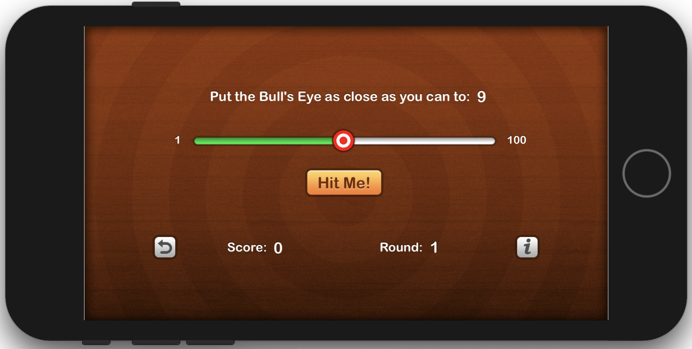
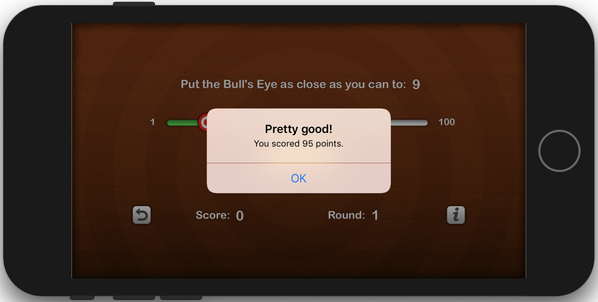
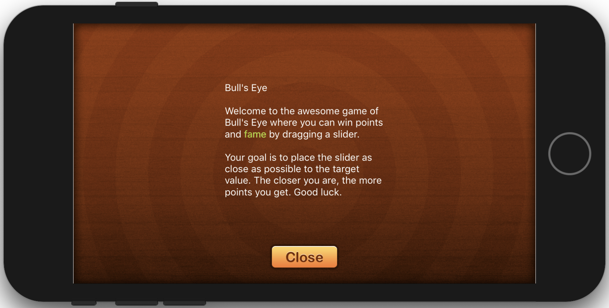

# Bull's Eye
Bull's Eye is a simple game with a simple objective. Given a target value, drag a slider and aim for the target value. 
The closer the slider's value is to the target value, the more points are scored.

This is based on <a href="https://www.raywenderlich.com/5993-your-first-ios-app">Ray Wenderlich's</a> guide.

## What I Learned
I chose this idea because it allowed me to learn about user touch input, working with that input, and working with more than one screenview.

Concepts learned:
* Swift Basics
* Outlets
* Controls
* Autolayout
* Saving Data
* Notifications

## Screenshots

